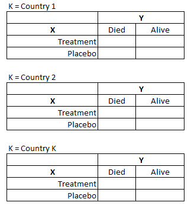

# Cochran Mantel Haenszel Test


The CMH procedure tests for conditional independence in partial contingency tables for a 2 x 2 x K design. However, it can be generalized to tables of X x Y x K dimensions.



## Naming Convention
For the remainder of this document, we adopt the following naming convention when referring to variables of a contingency table:

- X = exposure 
- Y = response 
- K = control  

## Scale
The `scale` of the exposure (X) and response (Y) variables dictate which test statistic is computed for the contingency table. Each test statistic is evaluated on different degrees of freedom (df):

- `General association` statistic (X and Y both nominal) results in `(X-1) * (Y-1) dfs`
- `Row mean` scores statistic (X is nominal and Y is ordinal) results in `X-1 dfs`
- `Nonzero correlation` statistic (X and Y both ordinal) results in `1 df`

## Testing Strategy

### Data

To begin investigating the differences in the SAS and R implementations of the CMH test, we decided to use the CDISC Pilot data set, which is publicly available on the PHUSE Test Data Factory repository. We applied very basic filtering conditions upfront (see below) and this data set served as the basis of the examples to follow.


```r
# Download CDISC Pilot Dataset
# Perform filtering
library(haven)
read_xpt("https://github.com/phuse-org/TestDataFactory/raw/main/Updated/TDF_ADaM/adcibc.xpt") %>% 
  filter(EFFFL == 'Y' & ITTFL == 'Y', AVISITN == 8 & ANL01FL=='Y') 
```

### Schemes
In order to follow a systematic approach to testing, and to cover variations in the CMH test, we considered the traditional 2 x 2 x K design as well as scenarios where the generalized CMH test is employed (e.g. 5 x 3 x  3).

We present 5 archetype test scenarios that illustrate diverging results, possibly related to sparse data and possibly considered edge cases.

| Number  | Schema |  Variables | Relevant Test | Description |   
|---|---|---|---|---|
|  1 | 2x2x2   | X = TRTP, Y = SEX, K = AGEGR1  | General Association | TRTP and AGEGR1 were limited to two categories, overall the the groups were rather balanced |   
|   3| 2x2x3  | X = TRTP, Y = SEX, K = RACE  |  General Association |   Gives back NaN in R because RACE is very imbalanced|
|   6| 2x5x2  | X = TRTP, Y = AVAL, K = SEX  |  Row Means |   Compare Row Means results for R and SAS because Y is ordinal|
|   9|  3x5x17 |X = TRTP, Y = AVAL, K = SITEID   | Row Means   | SITEID has many strata and provokes sparse groups, AVAL is ordinal, therefore row means statistic applies here, R threw an error  | 
| 10 | 5x3x3  | X = AVAL, Y = AGEGR1, K = TRTP |  Correlation | X and Y are ordinal variables and therefore the correlation statistics has to be taken here |

## Implementation

### CMH in SAS 

The cmh test is calculated in SAS using the PROC FREQ procedure. By default, it outputs the chi square statistic, degrees of freedom and p-value for each of the three alternative hypothesis: `general association`, `row means differ`, and `nonzero correlation`. It is up to the statistical analyst or statistician to know which result is appropriate for their analysis.

When the design of the contingency table is 2 x 2 x K (i.e, X == 2 levels, Y == 2 levels, K >= 2 levels), the Mantel-Haenszel Common Odds Ratio (odds ratio estimate, 95% CI, P-value) and the Breslow-Day Test for Homogeneity of the Odds Ratios (chi-square statistic, degrees of freedom, P-value) are also output.

Below is the syntax to conduct a CMH analysis in SAS:

```r
Proc freq data = filtered_data; 
tables K * X * Y / cmh; 
* the order of K, X, and Y appearing on the line is important!;
run; 
```

### In R 

We did not find any R package that delivers all the same measures as SAS at once. Therefore, we tried out multiple packages: 

```{=html}
<div id="htmlwidget-e7a64df40949f1a29561" class="reactable html-widget" style="width:auto;height:auto;"></div>
<script type="application/json" data-for="htmlwidget-e7a64df40949f1a29561">{"x":{"tag":{"name":"Reactable","attribs":{"data":{"Package":["stats::mantelhaen.test()","vcdExtra::CMHtest()","epiDisplay::mhor()"],"General Association":["✅","✅","❌"],"Row Means Differ":["❌","✅","❌"],"Nonzero Correlation":["❌","✅","❌"],"M-H Odds Ratio":["✅","❌","✅"],"Homogeneity Test":["❌","❌","✅"],"Note":["Works well for 2x2xK","Problems with sparsity, potential bug","OR are limited to 2x2xK design"]},"columns":[{"accessor":"Package","name":"Package","type":"character","html":true,"align":"center","width":170},{"accessor":"General Association","name":"General Association","type":"character","html":true,"align":"center"},{"accessor":"Row Means Differ","name":"Row Means Differ","type":"character","html":true,"align":"center"},{"accessor":"Nonzero Correlation","name":"Nonzero Correlation","type":"character","html":true,"align":"center"},{"accessor":"M-H Odds Ratio","name":"M-H Odds Ratio","type":"character","html":true,"align":"center"},{"accessor":"Homogeneity Test","name":"Homogeneity Test","type":"character","html":true,"align":"center"},{"accessor":"Note","name":"Note","type":"character","html":true,"align":"center","width":120}],"defaultPageSize":10,"paginationType":"numbers","showPageInfo":true,"minRows":1,"dataKey":"64216caa36a6dd9c60e1a8145c8c02d2"},"children":[]},"class":"reactR_markup"},"evals":[],"jsHooks":[]}</script>
```

#### mantelhaen.test()

This is included in a base installation of R, as part of the stats package. Requires inputting data as a *table* or as *vectors*.


```r
mantelhaen.test(x = data$x, y = data$y, z = data$k)
```

#### CMHtest()

The vcdExtra package provides results for the generalized CMH test, for each of the three model it outputs the Chi-square value and the respective p-values. Flexible data input methods available: *table* or *formula* (aggregated level data in a data frame).


```r
library(vcdExtra)
CMHtest(Freq ~ X + Y | K , data=data, overall=TRUE) 
```
  
##### Forked Version - Solution for sparse data

To tackle the [issue with sparse data](https://github.com/friendly/vcdExtra/issues/3) it is recommended that a use of `solve()` is replaced with `MASS::ginv`. This was implemented in the forked version of vcdExtra which can be installed from here: 


```r
devtools::install_github("mstackhouse/vcdExtra")
```

However, also the forked version for the vcdExtra package works only until a certain level of sparsity. In case of our data, it still works if the data are stratified by the pooled Site ID (SITEGR1 - 11 unique values) whereas using the unpooled Site ID (SITEID - 17 unique values) also throws an error. 

##### Inconsistent Results 

Exploring the vcdExtra package in detail we realized that there seems to be a bug in the implementation which we would like to highlight here.

Using an independent data example (3x2x2), we first ran the CMH test through SAS and obtained the following:


```r
# Cochran-Mantel-Haenszel Statistics (Based on Table Scores)
# Statistic    Alternative Hypothesis    DF       Value      Prob
# ---------------------------------------------------------------
#   1        Nonzero Correlation        1      6.4586    0.0110
#   2        Row Mean Scores Differ     2     26.0278    <.0001
#   3        General Association        2     26.0278    <.0001
```


When we specify the analysis in R this way, we get the following results:


```r
CMHtest(Freq~x+y|k, data=test_eg, overall=TRUE, details=TRUE)$ALL$table
```

```
##         Chisq    Df Prob        
## cor     6.458575 1  0.01104181  
## rmeans  26.02779 2  2.229135e-06
## cmeans  6.458575 1  0.01104181  
## general 26.02779 2  2.229135e-06
```

By default, all 3 tests (and a 4th) are output. The results seem to match.

When we specify the analysis using an explicit *type* argument, we get the following results:


```r
CMHtest(Freq~x+y|k, data=test_eg, overall=TRUE, details=TRUE, type = "ALL")$ALL$table
```

```
##         Chisq    Df Prob        
## general 26.02779 1  3.365374e-07
## rmeans  26.02779 2  2.229135e-06
## cmeans  6.458575 1  0.01104181  
## cor     6.458575 2  0.03958569
```

While we've essentially asked for everything (i.e. the default), albeit explicitly, the results do not match. The degrees of freedom seem to be mismatched with results in wrong p-values (if we assume SAS is the gold standard)

Similarly, if we specify we would *only* like certain tests returned, the results seem dependent on the order of specification:


```r
# Order: cor, general, rmeans
CMHtest(Freq~x+y|k, data=test_eg, overall=TRUE, details=TRUE, types=c("cor","general","rmeans"))$ALL$table
```

```
##         Chisq    Df Prob        
## cor     6.458575 1  0.01104181  
## general 26.02779 2  2.229135e-06
## rmeans  26.02779 2  2.229135e-06
```


```r
# Order: rmeans, general, cor
CMHtest(Freq~x+y|k, data=test_eg, overall=TRUE, details=TRUE, types=c("rmeans","general","cor"))$ALL$table
```

```
##         Chisq    Df Prob        
## rmeans  26.02779 1  3.365374e-07
## general 26.02779 2  2.229135e-06
## cor     6.458575 2  0.03958569
```

Impact: In the event of a 2x2xK design, all 3 test statistics, degrees of freedom and p-values are the same. Therefore, specifying a 2x2xK analysis any of the ways above results in correct "answer", though they are technically mixed up. 

This is why we chose as a 3x2x2, so we can clearly *where* things are mixed up. 

We are planning to submit an issue to the vcdExtra github for the author's review.

#### Epi Display package 

To get the M-H common odds ratio and the homogeneity test, the epiDisplay package can be used. 


```r
library(epiDisplay) 
mhor(x,y,k, graph = FALSE)
```

## Results

Here the results can be seen: 

### CMH Statistics 


```{=html}
<div id="rvsslaivbt" style="overflow-x:auto;overflow-y:auto;width:auto;height:auto;">
<style>html {
  font-family: -apple-system, BlinkMacSystemFont, 'Segoe UI', Roboto, Oxygen, Ubuntu, Cantarell, 'Helvetica Neue', 'Fira Sans', 'Droid Sans', Arial, sans-serif;
}

#rvsslaivbt .gt_table {
  display: table;
  border-collapse: collapse;
  margin-left: auto;
  margin-right: auto;
  color: #333333;
  font-size: 16px;
  font-weight: normal;
  font-style: normal;
  background-color: #FFFFFF;
  width: auto;
  border-top-style: solid;
  border-top-width: 2px;
  border-top-color: #A8A8A8;
  border-right-style: none;
  border-right-width: 2px;
  border-right-color: #D3D3D3;
  border-bottom-style: solid;
  border-bottom-width: 2px;
  border-bottom-color: #A8A8A8;
  border-left-style: none;
  border-left-width: 2px;
  border-left-color: #D3D3D3;
}

#rvsslaivbt .gt_heading {
  background-color: #FFFFFF;
  text-align: left;
  border-bottom-color: #FFFFFF;
  border-left-style: none;
  border-left-width: 1px;
  border-left-color: #D3D3D3;
  border-right-style: none;
  border-right-width: 1px;
  border-right-color: #D3D3D3;
}

#rvsslaivbt .gt_title {
  color: #333333;
  font-size: 125%;
  font-weight: initial;
  padding-top: 4px;
  padding-bottom: 4px;
  padding-left: 5px;
  padding-right: 5px;
  border-bottom-color: #FFFFFF;
  border-bottom-width: 0;
}

#rvsslaivbt .gt_subtitle {
  color: #333333;
  font-size: 85%;
  font-weight: initial;
  padding-top: 0;
  padding-bottom: 6px;
  padding-left: 5px;
  padding-right: 5px;
  border-top-color: #FFFFFF;
  border-top-width: 0;
}

#rvsslaivbt .gt_bottom_border {
  border-bottom-style: solid;
  border-bottom-width: 2px;
  border-bottom-color: #D3D3D3;
}

#rvsslaivbt .gt_col_headings {
  border-top-style: solid;
  border-top-width: 2px;
  border-top-color: #D3D3D3;
  border-bottom-style: solid;
  border-bottom-width: 2px;
  border-bottom-color: #D3D3D3;
  border-left-style: none;
  border-left-width: 1px;
  border-left-color: #D3D3D3;
  border-right-style: none;
  border-right-width: 1px;
  border-right-color: #D3D3D3;
}

#rvsslaivbt .gt_col_heading {
  color: #333333;
  background-color: #FFFFFF;
  font-size: 100%;
  font-weight: normal;
  text-transform: inherit;
  border-left-style: none;
  border-left-width: 1px;
  border-left-color: #D3D3D3;
  border-right-style: none;
  border-right-width: 1px;
  border-right-color: #D3D3D3;
  vertical-align: bottom;
  padding-top: 5px;
  padding-bottom: 6px;
  padding-left: 5px;
  padding-right: 5px;
  overflow-x: hidden;
}

#rvsslaivbt .gt_column_spanner_outer {
  color: #333333;
  background-color: #FFFFFF;
  font-size: 100%;
  font-weight: normal;
  text-transform: inherit;
  padding-top: 0;
  padding-bottom: 0;
  padding-left: 4px;
  padding-right: 4px;
}

#rvsslaivbt .gt_column_spanner_outer:first-child {
  padding-left: 0;
}

#rvsslaivbt .gt_column_spanner_outer:last-child {
  padding-right: 0;
}

#rvsslaivbt .gt_column_spanner {
  border-bottom-style: solid;
  border-bottom-width: 2px;
  border-bottom-color: #D3D3D3;
  vertical-align: bottom;
  padding-top: 5px;
  padding-bottom: 5px;
  overflow-x: hidden;
  display: inline-block;
  width: 100%;
}

#rvsslaivbt .gt_group_heading {
  padding-top: 8px;
  padding-bottom: 8px;
  padding-left: 5px;
  padding-right: 5px;
  color: #333333;
  background-color: #FFFFFF;
  font-size: 100%;
  font-weight: initial;
  text-transform: inherit;
  border-top-style: solid;
  border-top-width: 2px;
  border-top-color: #D3D3D3;
  border-bottom-style: solid;
  border-bottom-width: 2px;
  border-bottom-color: #D3D3D3;
  border-left-style: none;
  border-left-width: 1px;
  border-left-color: #D3D3D3;
  border-right-style: none;
  border-right-width: 1px;
  border-right-color: #D3D3D3;
  vertical-align: middle;
}

#rvsslaivbt .gt_empty_group_heading {
  padding: 0.5px;
  color: #333333;
  background-color: #FFFFFF;
  font-size: 100%;
  font-weight: initial;
  border-top-style: solid;
  border-top-width: 2px;
  border-top-color: #D3D3D3;
  border-bottom-style: solid;
  border-bottom-width: 2px;
  border-bottom-color: #D3D3D3;
  vertical-align: middle;
}

#rvsslaivbt .gt_from_md > :first-child {
  margin-top: 0;
}

#rvsslaivbt .gt_from_md > :last-child {
  margin-bottom: 0;
}

#rvsslaivbt .gt_row {
  padding-top: 8px;
  padding-bottom: 8px;
  padding-left: 5px;
  padding-right: 5px;
  margin: 10px;
  border-top-style: solid;
  border-top-width: 1px;
  border-top-color: #D3D3D3;
  border-left-style: none;
  border-left-width: 1px;
  border-left-color: #D3D3D3;
  border-right-style: none;
  border-right-width: 1px;
  border-right-color: #D3D3D3;
  vertical-align: middle;
  overflow-x: hidden;
}

#rvsslaivbt .gt_stub {
  color: #333333;
  background-color: #FFFFFF;
  font-size: 100%;
  font-weight: initial;
  text-transform: inherit;
  border-right-style: solid;
  border-right-width: 2px;
  border-right-color: #D3D3D3;
  padding-left: 5px;
  padding-right: 5px;
}

#rvsslaivbt .gt_stub_row_group {
  color: #333333;
  background-color: #FFFFFF;
  font-size: 100%;
  font-weight: initial;
  text-transform: inherit;
  border-right-style: solid;
  border-right-width: 2px;
  border-right-color: #D3D3D3;
  padding-left: 5px;
  padding-right: 5px;
  vertical-align: top;
}

#rvsslaivbt .gt_row_group_first td {
  border-top-width: 2px;
}

#rvsslaivbt .gt_summary_row {
  color: #333333;
  background-color: #FFFFFF;
  text-transform: inherit;
  padding-top: 8px;
  padding-bottom: 8px;
  padding-left: 5px;
  padding-right: 5px;
}

#rvsslaivbt .gt_first_summary_row {
  border-top-style: solid;
  border-top-color: #D3D3D3;
}

#rvsslaivbt .gt_first_summary_row.thick {
  border-top-width: 2px;
}

#rvsslaivbt .gt_last_summary_row {
  padding-top: 8px;
  padding-bottom: 8px;
  padding-left: 5px;
  padding-right: 5px;
  border-bottom-style: solid;
  border-bottom-width: 2px;
  border-bottom-color: #D3D3D3;
}

#rvsslaivbt .gt_grand_summary_row {
  color: #333333;
  background-color: #FFFFFF;
  text-transform: inherit;
  padding-top: 8px;
  padding-bottom: 8px;
  padding-left: 5px;
  padding-right: 5px;
}

#rvsslaivbt .gt_first_grand_summary_row {
  padding-top: 8px;
  padding-bottom: 8px;
  padding-left: 5px;
  padding-right: 5px;
  border-top-style: double;
  border-top-width: 6px;
  border-top-color: #D3D3D3;
}

#rvsslaivbt .gt_striped {
  background-color: rgba(128, 128, 128, 0.05);
}

#rvsslaivbt .gt_table_body {
  border-top-style: solid;
  border-top-width: 2px;
  border-top-color: #D3D3D3;
  border-bottom-style: solid;
  border-bottom-width: 2px;
  border-bottom-color: #D3D3D3;
}

#rvsslaivbt .gt_footnotes {
  color: #333333;
  background-color: #FFFFFF;
  border-bottom-style: none;
  border-bottom-width: 2px;
  border-bottom-color: #D3D3D3;
  border-left-style: none;
  border-left-width: 2px;
  border-left-color: #D3D3D3;
  border-right-style: none;
  border-right-width: 2px;
  border-right-color: #D3D3D3;
}

#rvsslaivbt .gt_footnote {
  margin: 0px;
  font-size: 90%;
  padding-left: 4px;
  padding-right: 4px;
  padding-left: 5px;
  padding-right: 5px;
}

#rvsslaivbt .gt_sourcenotes {
  color: #333333;
  background-color: #FFFFFF;
  border-bottom-style: none;
  border-bottom-width: 2px;
  border-bottom-color: #D3D3D3;
  border-left-style: none;
  border-left-width: 2px;
  border-left-color: #D3D3D3;
  border-right-style: none;
  border-right-width: 2px;
  border-right-color: #D3D3D3;
}

#rvsslaivbt .gt_sourcenote {
  font-size: 90%;
  padding-top: 4px;
  padding-bottom: 4px;
  padding-left: 5px;
  padding-right: 5px;
}

#rvsslaivbt .gt_left {
  text-align: left;
}

#rvsslaivbt .gt_center {
  text-align: center;
}

#rvsslaivbt .gt_right {
  text-align: right;
  font-variant-numeric: tabular-nums;
}

#rvsslaivbt .gt_font_normal {
  font-weight: normal;
}

#rvsslaivbt .gt_font_bold {
  font-weight: bold;
}

#rvsslaivbt .gt_font_italic {
  font-style: italic;
}

#rvsslaivbt .gt_super {
  font-size: 65%;
}

#rvsslaivbt .gt_footnote_marks {
  font-style: italic;
  font-weight: normal;
  font-size: 75%;
  vertical-align: 0.4em;
}

#rvsslaivbt .gt_asterisk {
  font-size: 100%;
  vertical-align: 0;
}

#rvsslaivbt .gt_slash_mark {
  font-size: 0.7em;
  line-height: 0.7em;
  vertical-align: 0.15em;
}

#rvsslaivbt .gt_fraction_numerator {
  font-size: 0.6em;
  line-height: 0.6em;
  vertical-align: 0.45em;
}

#rvsslaivbt .gt_fraction_denominator {
  font-size: 0.6em;
  line-height: 0.6em;
  vertical-align: -0.05em;
}
</style>
<table class="gt_table" style="table-layout: fixed;; width: 0px">
  <colgroup>
    <col style="width:75px;"/>
    <col style="width:180px;"/>
    <col style="width:150px;"/>
    <col style="width:150px;"/>
    <col style="width:150px;"/>
    <col style="width:150px;"/>
    <col style="width:150px;"/>
    <col style="width:150px;"/>
  </colgroup>
  <thead class="gt_header">
    <tr>
      <th colspan="8" class="gt_heading gt_title gt_font_normal gt_bottom_border" style><strong>Cochran-Mantel-Haenszel Test Statistics</strong></th>
    </tr>
    
  </thead>
  <thead class="gt_col_headings">
    <tr>
      <th class="gt_col_heading gt_columns_bottom_border gt_left" rowspan="2" colspan="1"><strong>Schema</strong></th>
      <th class="gt_col_heading gt_columns_bottom_border gt_center" rowspan="2" colspan="1"><strong>Test</strong></th>
      <th class="gt_center gt_columns_top_border gt_column_spanner_outer" rowspan="1" colspan="2">
        <span class="gt_column_spanner"><strong>Chi-Square</strong></span>
      </th>
      <th class="gt_center gt_columns_top_border gt_column_spanner_outer" rowspan="1" colspan="2">
        <span class="gt_column_spanner"><strong>df</strong></span>
      </th>
      <th class="gt_center gt_columns_top_border gt_column_spanner_outer" rowspan="1" colspan="2">
        <span class="gt_column_spanner"><strong>P-Value</strong></span>
      </th>
    </tr>
    <tr>
      <th class="gt_col_heading gt_columns_bottom_border gt_center" rowspan="1" colspan="1">R</th>
      <th class="gt_col_heading gt_columns_bottom_border gt_center" rowspan="1" colspan="1">SAS</th>
      <th class="gt_col_heading gt_columns_bottom_border gt_center" rowspan="1" colspan="1">R</th>
      <th class="gt_col_heading gt_columns_bottom_border gt_center" rowspan="1" colspan="1">SAS</th>
      <th class="gt_col_heading gt_columns_bottom_border gt_center" rowspan="1" colspan="1">R</th>
      <th class="gt_col_heading gt_columns_bottom_border gt_center" rowspan="1" colspan="1">SAS</th>
    </tr>
  </thead>
  <tbody class="gt_table_body">
    <tr><td class="gt_row gt_left">1</td>
<td class="gt_row gt_center">Correlation</td>
<td class="gt_row gt_center">0.0176704</td>
<td class="gt_row gt_center">0.017670400</td>
<td class="gt_row gt_center">1</td>
<td class="gt_row gt_center">1</td>
<td class="gt_row gt_center">0.8942487</td>
<td class="gt_row gt_center">0.89424870</td></tr>
    <tr><td class="gt_row gt_left"> </td>
<td class="gt_row gt_center">Row Means</td>
<td class="gt_row gt_center">0.0176704</td>
<td class="gt_row gt_center">0.017670400</td>
<td class="gt_row gt_center">1</td>
<td class="gt_row gt_center">1</td>
<td class="gt_row gt_center">0.8942487</td>
<td class="gt_row gt_center">0.89424870</td></tr>
    <tr><td class="gt_row gt_left" style="background-color: #E0FFFF;"> </td>
<td class="gt_row gt_center" style="background-color: #E0FFFF;">General Association</td>
<td class="gt_row gt_center" style="background-color: #E0FFFF;">0.0176704</td>
<td class="gt_row gt_center" style="background-color: #E0FFFF;">0.017670400</td>
<td class="gt_row gt_center" style="background-color: #E0FFFF;">1</td>
<td class="gt_row gt_center" style="background-color: #E0FFFF;">1</td>
<td class="gt_row gt_center" style="background-color: #E0FFFF;">0.8942487</td>
<td class="gt_row gt_center" style="background-color: #E0FFFF;">0.89424870</td></tr>
    <tr><td class="gt_row gt_left">6</td>
<td class="gt_row gt_center">Correlation</td>
<td class="gt_row gt_center">0.13012</td>
<td class="gt_row gt_center">1.1472</td>
<td class="gt_row gt_center">1</td>
<td class="gt_row gt_center">1</td>
<td class="gt_row gt_center">0.71831</td>
<td class="gt_row gt_center">0.2841</td></tr>
    <tr><td class="gt_row gt_left" style="background-color: #E0FFFF;"> </td>
<td class="gt_row gt_center" style="background-color: #E0FFFF;">Row Means</td>
<td class="gt_row gt_center" style="background-color: #E0FFFF;">0.13012</td>
<td class="gt_row gt_center" style="background-color: #E0FFFF;">1.1472</td>
<td class="gt_row gt_center" style="background-color: #E0FFFF;">1</td>
<td class="gt_row gt_center" style="background-color: #E0FFFF;">1</td>
<td class="gt_row gt_center" style="background-color: #E0FFFF;">0.71831</td>
<td class="gt_row gt_center" style="background-color: #E0FFFF;">0.2841</td></tr>
    <tr><td class="gt_row gt_left"> </td>
<td class="gt_row gt_center">General Association</td>
<td class="gt_row gt_center">1.5771</td>
<td class="gt_row gt_center">2.5672</td>
<td class="gt_row gt_center">4</td>
<td class="gt_row gt_center">4</td>
<td class="gt_row gt_center">0.81397</td>
<td class="gt_row gt_center">0.6326</td></tr>
    <tr><td class="gt_row gt_left" style="background-color: #E0FFFF;">10</td>
<td class="gt_row gt_center" style="background-color: #E0FFFF;">Correlation</td>
<td class="gt_row gt_center" style="background-color: #E0FFFF;">0.8715295</td>
<td class="gt_row gt_center" style="background-color: #E0FFFF;">2.738160852</td>
<td class="gt_row gt_center" style="background-color: #E0FFFF;">1</td>
<td class="gt_row gt_center" style="background-color: #E0FFFF;">1</td>
<td class="gt_row gt_center" style="background-color: #E0FFFF;">0.3505322</td>
<td class="gt_row gt_center" style="background-color: #E0FFFF;">0.09797747</td></tr>
    <tr><td class="gt_row gt_left"> </td>
<td class="gt_row gt_center">Row Means</td>
<td class="gt_row gt_center">3.044527</td>
<td class="gt_row gt_center">4.407010917</td>
<td class="gt_row gt_center">4</td>
<td class="gt_row gt_center">4</td>
<td class="gt_row gt_center">0.5504018</td>
<td class="gt_row gt_center">0.35371641</td></tr>
    <tr><td class="gt_row gt_left"> </td>
<td class="gt_row gt_center">General Association</td>
<td class="gt_row gt_center">5.730538</td>
<td class="gt_row gt_center">5.730538193</td>
<td class="gt_row gt_center">8</td>
<td class="gt_row gt_center">8</td>
<td class="gt_row gt_center">0.6773861</td>
<td class="gt_row gt_center">0.67738613</td></tr>
  </tbody>
  
  
</table>
</div>
```
  
As it can be seen, there are two schemata where R does not provide any results:


```{=html}
<div id="cxyekpknwk" style="overflow-x:auto;overflow-y:auto;width:auto;height:auto;">
<style>html {
  font-family: -apple-system, BlinkMacSystemFont, 'Segoe UI', Roboto, Oxygen, Ubuntu, Cantarell, 'Helvetica Neue', 'Fira Sans', 'Droid Sans', Arial, sans-serif;
}

#cxyekpknwk .gt_table {
  display: table;
  border-collapse: collapse;
  margin-left: auto;
  margin-right: auto;
  color: #333333;
  font-size: 16px;
  font-weight: normal;
  font-style: normal;
  background-color: #FFFFFF;
  width: auto;
  border-top-style: solid;
  border-top-width: 2px;
  border-top-color: #A8A8A8;
  border-right-style: none;
  border-right-width: 2px;
  border-right-color: #D3D3D3;
  border-bottom-style: solid;
  border-bottom-width: 2px;
  border-bottom-color: #A8A8A8;
  border-left-style: none;
  border-left-width: 2px;
  border-left-color: #D3D3D3;
}

#cxyekpknwk .gt_heading {
  background-color: #FFFFFF;
  text-align: left;
  border-bottom-color: #FFFFFF;
  border-left-style: none;
  border-left-width: 1px;
  border-left-color: #D3D3D3;
  border-right-style: none;
  border-right-width: 1px;
  border-right-color: #D3D3D3;
}

#cxyekpknwk .gt_title {
  color: #333333;
  font-size: 125%;
  font-weight: initial;
  padding-top: 4px;
  padding-bottom: 4px;
  padding-left: 5px;
  padding-right: 5px;
  border-bottom-color: #FFFFFF;
  border-bottom-width: 0;
}

#cxyekpknwk .gt_subtitle {
  color: #333333;
  font-size: 85%;
  font-weight: initial;
  padding-top: 0;
  padding-bottom: 6px;
  padding-left: 5px;
  padding-right: 5px;
  border-top-color: #FFFFFF;
  border-top-width: 0;
}

#cxyekpknwk .gt_bottom_border {
  border-bottom-style: solid;
  border-bottom-width: 2px;
  border-bottom-color: #D3D3D3;
}

#cxyekpknwk .gt_col_headings {
  border-top-style: solid;
  border-top-width: 2px;
  border-top-color: #D3D3D3;
  border-bottom-style: solid;
  border-bottom-width: 2px;
  border-bottom-color: #D3D3D3;
  border-left-style: none;
  border-left-width: 1px;
  border-left-color: #D3D3D3;
  border-right-style: none;
  border-right-width: 1px;
  border-right-color: #D3D3D3;
}

#cxyekpknwk .gt_col_heading {
  color: #333333;
  background-color: #FFFFFF;
  font-size: 100%;
  font-weight: normal;
  text-transform: inherit;
  border-left-style: none;
  border-left-width: 1px;
  border-left-color: #D3D3D3;
  border-right-style: none;
  border-right-width: 1px;
  border-right-color: #D3D3D3;
  vertical-align: bottom;
  padding-top: 5px;
  padding-bottom: 6px;
  padding-left: 5px;
  padding-right: 5px;
  overflow-x: hidden;
}

#cxyekpknwk .gt_column_spanner_outer {
  color: #333333;
  background-color: #FFFFFF;
  font-size: 100%;
  font-weight: normal;
  text-transform: inherit;
  padding-top: 0;
  padding-bottom: 0;
  padding-left: 4px;
  padding-right: 4px;
}

#cxyekpknwk .gt_column_spanner_outer:first-child {
  padding-left: 0;
}

#cxyekpknwk .gt_column_spanner_outer:last-child {
  padding-right: 0;
}

#cxyekpknwk .gt_column_spanner {
  border-bottom-style: solid;
  border-bottom-width: 2px;
  border-bottom-color: #D3D3D3;
  vertical-align: bottom;
  padding-top: 5px;
  padding-bottom: 5px;
  overflow-x: hidden;
  display: inline-block;
  width: 100%;
}

#cxyekpknwk .gt_group_heading {
  padding-top: 8px;
  padding-bottom: 8px;
  padding-left: 5px;
  padding-right: 5px;
  color: #333333;
  background-color: #FFFFFF;
  font-size: 100%;
  font-weight: initial;
  text-transform: inherit;
  border-top-style: solid;
  border-top-width: 2px;
  border-top-color: #D3D3D3;
  border-bottom-style: solid;
  border-bottom-width: 2px;
  border-bottom-color: #D3D3D3;
  border-left-style: none;
  border-left-width: 1px;
  border-left-color: #D3D3D3;
  border-right-style: none;
  border-right-width: 1px;
  border-right-color: #D3D3D3;
  vertical-align: middle;
}

#cxyekpknwk .gt_empty_group_heading {
  padding: 0.5px;
  color: #333333;
  background-color: #FFFFFF;
  font-size: 100%;
  font-weight: initial;
  border-top-style: solid;
  border-top-width: 2px;
  border-top-color: #D3D3D3;
  border-bottom-style: solid;
  border-bottom-width: 2px;
  border-bottom-color: #D3D3D3;
  vertical-align: middle;
}

#cxyekpknwk .gt_from_md > :first-child {
  margin-top: 0;
}

#cxyekpknwk .gt_from_md > :last-child {
  margin-bottom: 0;
}

#cxyekpknwk .gt_row {
  padding-top: 8px;
  padding-bottom: 8px;
  padding-left: 5px;
  padding-right: 5px;
  margin: 10px;
  border-top-style: solid;
  border-top-width: 1px;
  border-top-color: #D3D3D3;
  border-left-style: none;
  border-left-width: 1px;
  border-left-color: #D3D3D3;
  border-right-style: none;
  border-right-width: 1px;
  border-right-color: #D3D3D3;
  vertical-align: middle;
  overflow-x: hidden;
}

#cxyekpknwk .gt_stub {
  color: #333333;
  background-color: #FFFFFF;
  font-size: 100%;
  font-weight: initial;
  text-transform: inherit;
  border-right-style: solid;
  border-right-width: 2px;
  border-right-color: #D3D3D3;
  padding-left: 5px;
  padding-right: 5px;
}

#cxyekpknwk .gt_stub_row_group {
  color: #333333;
  background-color: #FFFFFF;
  font-size: 100%;
  font-weight: initial;
  text-transform: inherit;
  border-right-style: solid;
  border-right-width: 2px;
  border-right-color: #D3D3D3;
  padding-left: 5px;
  padding-right: 5px;
  vertical-align: top;
}

#cxyekpknwk .gt_row_group_first td {
  border-top-width: 2px;
}

#cxyekpknwk .gt_summary_row {
  color: #333333;
  background-color: #FFFFFF;
  text-transform: inherit;
  padding-top: 8px;
  padding-bottom: 8px;
  padding-left: 5px;
  padding-right: 5px;
}

#cxyekpknwk .gt_first_summary_row {
  border-top-style: solid;
  border-top-color: #D3D3D3;
}

#cxyekpknwk .gt_first_summary_row.thick {
  border-top-width: 2px;
}

#cxyekpknwk .gt_last_summary_row {
  padding-top: 8px;
  padding-bottom: 8px;
  padding-left: 5px;
  padding-right: 5px;
  border-bottom-style: solid;
  border-bottom-width: 2px;
  border-bottom-color: #D3D3D3;
}

#cxyekpknwk .gt_grand_summary_row {
  color: #333333;
  background-color: #FFFFFF;
  text-transform: inherit;
  padding-top: 8px;
  padding-bottom: 8px;
  padding-left: 5px;
  padding-right: 5px;
}

#cxyekpknwk .gt_first_grand_summary_row {
  padding-top: 8px;
  padding-bottom: 8px;
  padding-left: 5px;
  padding-right: 5px;
  border-top-style: double;
  border-top-width: 6px;
  border-top-color: #D3D3D3;
}

#cxyekpknwk .gt_striped {
  background-color: rgba(128, 128, 128, 0.05);
}

#cxyekpknwk .gt_table_body {
  border-top-style: solid;
  border-top-width: 2px;
  border-top-color: #D3D3D3;
  border-bottom-style: solid;
  border-bottom-width: 2px;
  border-bottom-color: #D3D3D3;
}

#cxyekpknwk .gt_footnotes {
  color: #333333;
  background-color: #FFFFFF;
  border-bottom-style: none;
  border-bottom-width: 2px;
  border-bottom-color: #D3D3D3;
  border-left-style: none;
  border-left-width: 2px;
  border-left-color: #D3D3D3;
  border-right-style: none;
  border-right-width: 2px;
  border-right-color: #D3D3D3;
}

#cxyekpknwk .gt_footnote {
  margin: 0px;
  font-size: 90%;
  padding-left: 4px;
  padding-right: 4px;
  padding-left: 5px;
  padding-right: 5px;
}

#cxyekpknwk .gt_sourcenotes {
  color: #333333;
  background-color: #FFFFFF;
  border-bottom-style: none;
  border-bottom-width: 2px;
  border-bottom-color: #D3D3D3;
  border-left-style: none;
  border-left-width: 2px;
  border-left-color: #D3D3D3;
  border-right-style: none;
  border-right-width: 2px;
  border-right-color: #D3D3D3;
}

#cxyekpknwk .gt_sourcenote {
  font-size: 90%;
  padding-top: 4px;
  padding-bottom: 4px;
  padding-left: 5px;
  padding-right: 5px;
}

#cxyekpknwk .gt_left {
  text-align: left;
}

#cxyekpknwk .gt_center {
  text-align: center;
}

#cxyekpknwk .gt_right {
  text-align: right;
  font-variant-numeric: tabular-nums;
}

#cxyekpknwk .gt_font_normal {
  font-weight: normal;
}

#cxyekpknwk .gt_font_bold {
  font-weight: bold;
}

#cxyekpknwk .gt_font_italic {
  font-style: italic;
}

#cxyekpknwk .gt_super {
  font-size: 65%;
}

#cxyekpknwk .gt_footnote_marks {
  font-style: italic;
  font-weight: normal;
  font-size: 75%;
  vertical-align: 0.4em;
}

#cxyekpknwk .gt_asterisk {
  font-size: 100%;
  vertical-align: 0;
}

#cxyekpknwk .gt_slash_mark {
  font-size: 0.7em;
  line-height: 0.7em;
  vertical-align: 0.15em;
}

#cxyekpknwk .gt_fraction_numerator {
  font-size: 0.6em;
  line-height: 0.6em;
  vertical-align: 0.45em;
}

#cxyekpknwk .gt_fraction_denominator {
  font-size: 0.6em;
  line-height: 0.6em;
  vertical-align: -0.05em;
}
</style>
<table class="gt_table" style="table-layout: fixed;; width: 0px">
  <colgroup>
    <col style="width:75px;"/>
    <col style="width:180px;"/>
    <col style="width:150px;"/>
    <col style="width:150px;"/>
    <col style="width:150px;"/>
    <col style="width:150px;"/>
    <col style="width:150px;"/>
    <col style="width:150px;"/>
  </colgroup>
  <thead class="gt_header">
    <tr>
      <th colspan="8" class="gt_heading gt_title gt_font_normal gt_bottom_border" style><strong>Cochran-Mantel-Haenszel Test Statistics</strong></th>
    </tr>
    
  </thead>
  <thead class="gt_col_headings">
    <tr>
      <th class="gt_col_heading gt_columns_bottom_border gt_left" rowspan="2" colspan="1"><strong>Schema</strong></th>
      <th class="gt_col_heading gt_columns_bottom_border gt_center" rowspan="2" colspan="1"><strong>Test</strong></th>
      <th class="gt_center gt_columns_top_border gt_column_spanner_outer" rowspan="1" colspan="2">
        <span class="gt_column_spanner"><strong>Chi-Square</strong></span>
      </th>
      <th class="gt_center gt_columns_top_border gt_column_spanner_outer" rowspan="1" colspan="2">
        <span class="gt_column_spanner"><strong>df</strong></span>
      </th>
      <th class="gt_center gt_columns_top_border gt_column_spanner_outer" rowspan="1" colspan="2">
        <span class="gt_column_spanner"><strong>P-Value</strong></span>
      </th>
    </tr>
    <tr>
      <th class="gt_col_heading gt_columns_bottom_border gt_center" rowspan="1" colspan="1">R</th>
      <th class="gt_col_heading gt_columns_bottom_border gt_center" rowspan="1" colspan="1">SAS</th>
      <th class="gt_col_heading gt_columns_bottom_border gt_center" rowspan="1" colspan="1">R</th>
      <th class="gt_col_heading gt_columns_bottom_border gt_center" rowspan="1" colspan="1">SAS</th>
      <th class="gt_col_heading gt_columns_bottom_border gt_center" rowspan="1" colspan="1">R</th>
      <th class="gt_col_heading gt_columns_bottom_border gt_center" rowspan="1" colspan="1">SAS</th>
    </tr>
  </thead>
  <tbody class="gt_table_body">
    <tr><td class="gt_row gt_left">3</td>
<td class="gt_row gt_center">Correlation</td>
<td class="gt_row gt_center">NaN</td>
<td class="gt_row gt_center">0.002787130</td>
<td class="gt_row gt_center">1</td>
<td class="gt_row gt_center">1</td>
<td class="gt_row gt_center">NaN</td>
<td class="gt_row gt_center">0.95789662</td></tr>
    <tr><td class="gt_row gt_left"> </td>
<td class="gt_row gt_center">Row Means</td>
<td class="gt_row gt_center">NaN</td>
<td class="gt_row gt_center">2.386069847</td>
<td class="gt_row gt_center">2</td>
<td class="gt_row gt_center">2</td>
<td class="gt_row gt_center">NaN</td>
<td class="gt_row gt_center">0.30329938</td></tr>
    <tr><td class="gt_row gt_left" style="background-color: #E0FFFF;"> </td>
<td class="gt_row gt_center" style="background-color: #E0FFFF;">General Association</td>
<td class="gt_row gt_center" style="background-color: #E0FFFF;">NaN</td>
<td class="gt_row gt_center" style="background-color: #E0FFFF;">2.386069847</td>
<td class="gt_row gt_center" style="background-color: #E0FFFF;">2</td>
<td class="gt_row gt_center" style="background-color: #E0FFFF;">2</td>
<td class="gt_row gt_center" style="background-color: #E0FFFF;">NaN</td>
<td class="gt_row gt_center" style="background-color: #E0FFFF;">0.30329938</td></tr>
    <tr><td class="gt_row gt_left">9</td>
<td class="gt_row gt_center">Correlation</td>
<td class="gt_row gt_center">Error</td>
<td class="gt_row gt_center">0.085443119</td>
<td class="gt_row gt_center">Error</td>
<td class="gt_row gt_center">1</td>
<td class="gt_row gt_center">Error</td>
<td class="gt_row gt_center">0.77005225</td></tr>
    <tr><td class="gt_row gt_left" style="background-color: #E0FFFF;"> </td>
<td class="gt_row gt_center" style="background-color: #E0FFFF;">Row Means</td>
<td class="gt_row gt_center" style="background-color: #E0FFFF;">Error</td>
<td class="gt_row gt_center" style="background-color: #E0FFFF;">2.476313667</td>
<td class="gt_row gt_center" style="background-color: #E0FFFF;">Error</td>
<td class="gt_row gt_center" style="background-color: #E0FFFF;">2</td>
<td class="gt_row gt_center" style="background-color: #E0FFFF;">Error</td>
<td class="gt_row gt_center" style="background-color: #E0FFFF;">0.28991809</td></tr>
    <tr><td class="gt_row gt_left"> </td>
<td class="gt_row gt_center">General Association</td>
<td class="gt_row gt_center">Error</td>
<td class="gt_row gt_center">7.033878442</td>
<td class="gt_row gt_center">Error</td>
<td class="gt_row gt_center">8</td>
<td class="gt_row gt_center">Error</td>
<td class="gt_row gt_center">0.53298189</td></tr>
  </tbody>
  
  
</table>
</div>
```

**Reason for NaN in schema 3**:  Stratum k = AMERICAN INDIAN OR ALASKA NATIVE can not be compared because there are only values for one treatment and one gender.  
**Reason for Error 4:**   
For large sparse table (many strata) CMHTest will occasionally throw an error in solve.default(AVA) because of singularity

### Odds Ratio

Only applicable to 2x2xK designs.


```{=html}
<div id="byisikgesq" style="overflow-x:auto;overflow-y:auto;width:auto;height:auto;">
<style>html {
  font-family: -apple-system, BlinkMacSystemFont, 'Segoe UI', Roboto, Oxygen, Ubuntu, Cantarell, 'Helvetica Neue', 'Fira Sans', 'Droid Sans', Arial, sans-serif;
}

#byisikgesq .gt_table {
  display: table;
  border-collapse: collapse;
  margin-left: auto;
  margin-right: auto;
  color: #333333;
  font-size: 16px;
  font-weight: normal;
  font-style: normal;
  background-color: #FFFFFF;
  width: auto;
  border-top-style: solid;
  border-top-width: 2px;
  border-top-color: #A8A8A8;
  border-right-style: none;
  border-right-width: 2px;
  border-right-color: #D3D3D3;
  border-bottom-style: solid;
  border-bottom-width: 2px;
  border-bottom-color: #A8A8A8;
  border-left-style: none;
  border-left-width: 2px;
  border-left-color: #D3D3D3;
}

#byisikgesq .gt_heading {
  background-color: #FFFFFF;
  text-align: left;
  border-bottom-color: #FFFFFF;
  border-left-style: none;
  border-left-width: 1px;
  border-left-color: #D3D3D3;
  border-right-style: none;
  border-right-width: 1px;
  border-right-color: #D3D3D3;
}

#byisikgesq .gt_title {
  color: #333333;
  font-size: 125%;
  font-weight: initial;
  padding-top: 4px;
  padding-bottom: 4px;
  padding-left: 5px;
  padding-right: 5px;
  border-bottom-color: #FFFFFF;
  border-bottom-width: 0;
}

#byisikgesq .gt_subtitle {
  color: #333333;
  font-size: 85%;
  font-weight: initial;
  padding-top: 0;
  padding-bottom: 6px;
  padding-left: 5px;
  padding-right: 5px;
  border-top-color: #FFFFFF;
  border-top-width: 0;
}

#byisikgesq .gt_bottom_border {
  border-bottom-style: solid;
  border-bottom-width: 2px;
  border-bottom-color: #D3D3D3;
}

#byisikgesq .gt_col_headings {
  border-top-style: solid;
  border-top-width: 2px;
  border-top-color: #D3D3D3;
  border-bottom-style: solid;
  border-bottom-width: 2px;
  border-bottom-color: #D3D3D3;
  border-left-style: none;
  border-left-width: 1px;
  border-left-color: #D3D3D3;
  border-right-style: none;
  border-right-width: 1px;
  border-right-color: #D3D3D3;
}

#byisikgesq .gt_col_heading {
  color: #333333;
  background-color: #FFFFFF;
  font-size: 100%;
  font-weight: normal;
  text-transform: inherit;
  border-left-style: none;
  border-left-width: 1px;
  border-left-color: #D3D3D3;
  border-right-style: none;
  border-right-width: 1px;
  border-right-color: #D3D3D3;
  vertical-align: bottom;
  padding-top: 5px;
  padding-bottom: 6px;
  padding-left: 5px;
  padding-right: 5px;
  overflow-x: hidden;
}

#byisikgesq .gt_column_spanner_outer {
  color: #333333;
  background-color: #FFFFFF;
  font-size: 100%;
  font-weight: normal;
  text-transform: inherit;
  padding-top: 0;
  padding-bottom: 0;
  padding-left: 4px;
  padding-right: 4px;
}

#byisikgesq .gt_column_spanner_outer:first-child {
  padding-left: 0;
}

#byisikgesq .gt_column_spanner_outer:last-child {
  padding-right: 0;
}

#byisikgesq .gt_column_spanner {
  border-bottom-style: solid;
  border-bottom-width: 2px;
  border-bottom-color: #D3D3D3;
  vertical-align: bottom;
  padding-top: 5px;
  padding-bottom: 5px;
  overflow-x: hidden;
  display: inline-block;
  width: 100%;
}

#byisikgesq .gt_group_heading {
  padding-top: 8px;
  padding-bottom: 8px;
  padding-left: 5px;
  padding-right: 5px;
  color: #333333;
  background-color: #FFFFFF;
  font-size: 100%;
  font-weight: initial;
  text-transform: inherit;
  border-top-style: solid;
  border-top-width: 2px;
  border-top-color: #D3D3D3;
  border-bottom-style: solid;
  border-bottom-width: 2px;
  border-bottom-color: #D3D3D3;
  border-left-style: none;
  border-left-width: 1px;
  border-left-color: #D3D3D3;
  border-right-style: none;
  border-right-width: 1px;
  border-right-color: #D3D3D3;
  vertical-align: middle;
}

#byisikgesq .gt_empty_group_heading {
  padding: 0.5px;
  color: #333333;
  background-color: #FFFFFF;
  font-size: 100%;
  font-weight: initial;
  border-top-style: solid;
  border-top-width: 2px;
  border-top-color: #D3D3D3;
  border-bottom-style: solid;
  border-bottom-width: 2px;
  border-bottom-color: #D3D3D3;
  vertical-align: middle;
}

#byisikgesq .gt_from_md > :first-child {
  margin-top: 0;
}

#byisikgesq .gt_from_md > :last-child {
  margin-bottom: 0;
}

#byisikgesq .gt_row {
  padding-top: 8px;
  padding-bottom: 8px;
  padding-left: 5px;
  padding-right: 5px;
  margin: 10px;
  border-top-style: solid;
  border-top-width: 1px;
  border-top-color: #D3D3D3;
  border-left-style: none;
  border-left-width: 1px;
  border-left-color: #D3D3D3;
  border-right-style: none;
  border-right-width: 1px;
  border-right-color: #D3D3D3;
  vertical-align: middle;
  overflow-x: hidden;
}

#byisikgesq .gt_stub {
  color: #333333;
  background-color: #FFFFFF;
  font-size: 100%;
  font-weight: initial;
  text-transform: inherit;
  border-right-style: solid;
  border-right-width: 2px;
  border-right-color: #D3D3D3;
  padding-left: 5px;
  padding-right: 5px;
}

#byisikgesq .gt_stub_row_group {
  color: #333333;
  background-color: #FFFFFF;
  font-size: 100%;
  font-weight: initial;
  text-transform: inherit;
  border-right-style: solid;
  border-right-width: 2px;
  border-right-color: #D3D3D3;
  padding-left: 5px;
  padding-right: 5px;
  vertical-align: top;
}

#byisikgesq .gt_row_group_first td {
  border-top-width: 2px;
}

#byisikgesq .gt_summary_row {
  color: #333333;
  background-color: #FFFFFF;
  text-transform: inherit;
  padding-top: 8px;
  padding-bottom: 8px;
  padding-left: 5px;
  padding-right: 5px;
}

#byisikgesq .gt_first_summary_row {
  border-top-style: solid;
  border-top-color: #D3D3D3;
}

#byisikgesq .gt_first_summary_row.thick {
  border-top-width: 2px;
}

#byisikgesq .gt_last_summary_row {
  padding-top: 8px;
  padding-bottom: 8px;
  padding-left: 5px;
  padding-right: 5px;
  border-bottom-style: solid;
  border-bottom-width: 2px;
  border-bottom-color: #D3D3D3;
}

#byisikgesq .gt_grand_summary_row {
  color: #333333;
  background-color: #FFFFFF;
  text-transform: inherit;
  padding-top: 8px;
  padding-bottom: 8px;
  padding-left: 5px;
  padding-right: 5px;
}

#byisikgesq .gt_first_grand_summary_row {
  padding-top: 8px;
  padding-bottom: 8px;
  padding-left: 5px;
  padding-right: 5px;
  border-top-style: double;
  border-top-width: 6px;
  border-top-color: #D3D3D3;
}

#byisikgesq .gt_striped {
  background-color: rgba(128, 128, 128, 0.05);
}

#byisikgesq .gt_table_body {
  border-top-style: solid;
  border-top-width: 2px;
  border-top-color: #D3D3D3;
  border-bottom-style: solid;
  border-bottom-width: 2px;
  border-bottom-color: #D3D3D3;
}

#byisikgesq .gt_footnotes {
  color: #333333;
  background-color: #FFFFFF;
  border-bottom-style: none;
  border-bottom-width: 2px;
  border-bottom-color: #D3D3D3;
  border-left-style: none;
  border-left-width: 2px;
  border-left-color: #D3D3D3;
  border-right-style: none;
  border-right-width: 2px;
  border-right-color: #D3D3D3;
}

#byisikgesq .gt_footnote {
  margin: 0px;
  font-size: 90%;
  padding-left: 4px;
  padding-right: 4px;
  padding-left: 5px;
  padding-right: 5px;
}

#byisikgesq .gt_sourcenotes {
  color: #333333;
  background-color: #FFFFFF;
  border-bottom-style: none;
  border-bottom-width: 2px;
  border-bottom-color: #D3D3D3;
  border-left-style: none;
  border-left-width: 2px;
  border-left-color: #D3D3D3;
  border-right-style: none;
  border-right-width: 2px;
  border-right-color: #D3D3D3;
}

#byisikgesq .gt_sourcenote {
  font-size: 90%;
  padding-top: 4px;
  padding-bottom: 4px;
  padding-left: 5px;
  padding-right: 5px;
}

#byisikgesq .gt_left {
  text-align: left;
}

#byisikgesq .gt_center {
  text-align: center;
}

#byisikgesq .gt_right {
  text-align: right;
  font-variant-numeric: tabular-nums;
}

#byisikgesq .gt_font_normal {
  font-weight: normal;
}

#byisikgesq .gt_font_bold {
  font-weight: bold;
}

#byisikgesq .gt_font_italic {
  font-style: italic;
}

#byisikgesq .gt_super {
  font-size: 65%;
}

#byisikgesq .gt_footnote_marks {
  font-style: italic;
  font-weight: normal;
  font-size: 75%;
  vertical-align: 0.4em;
}

#byisikgesq .gt_asterisk {
  font-size: 100%;
  vertical-align: 0;
}

#byisikgesq .gt_slash_mark {
  font-size: 0.7em;
  line-height: 0.7em;
  vertical-align: 0.15em;
}

#byisikgesq .gt_fraction_numerator {
  font-size: 0.6em;
  line-height: 0.6em;
  vertical-align: 0.45em;
}

#byisikgesq .gt_fraction_denominator {
  font-size: 0.6em;
  line-height: 0.6em;
  vertical-align: -0.05em;
}
</style>
<table class="gt_table" style="table-layout: fixed;; width: 0px">
  <colgroup>
    <col style="width:75px;"/>
    <col style="width:130px;"/>
    <col style="width:130px;"/>
    <col style="width:130px;"/>
    <col style="width:130px;"/>
    <col style="width:130px;"/>
    <col style="width:130px;"/>
    <col style="width:130px;"/>
    <col style="width:130px;"/>
  </colgroup>
  <thead class="gt_header">
    <tr>
      <th colspan="9" class="gt_heading gt_title gt_font_normal gt_bottom_border" style><strong>Cochran-Mantel-Haenszel Odds Ratios</strong></th>
    </tr>
    
  </thead>
  <thead class="gt_col_headings">
    <tr>
      <th class="gt_col_heading gt_columns_bottom_border gt_left" rowspan="2" colspan="1"><strong>Schema</strong></th>
      <th class="gt_center gt_columns_top_border gt_column_spanner_outer" rowspan="1" colspan="2">
        <span class="gt_column_spanner"><strong>OR</strong></span>
      </th>
      <th class="gt_center gt_columns_top_border gt_column_spanner_outer" rowspan="1" colspan="2">
        <span class="gt_column_spanner"><strong>LCL</strong></span>
      </th>
      <th class="gt_center gt_columns_top_border gt_column_spanner_outer" rowspan="1" colspan="2">
        <span class="gt_column_spanner"><strong>UCL</strong></span>
      </th>
      <th class="gt_center gt_columns_top_border gt_column_spanner_outer" rowspan="1" colspan="2">
        <span class="gt_column_spanner"><strong>P-Value</strong></span>
      </th>
    </tr>
    <tr>
      <th class="gt_col_heading gt_columns_bottom_border gt_center" rowspan="1" colspan="1">R</th>
      <th class="gt_col_heading gt_columns_bottom_border gt_center" rowspan="1" colspan="1">SAS</th>
      <th class="gt_col_heading gt_columns_bottom_border gt_center" rowspan="1" colspan="1">R</th>
      <th class="gt_col_heading gt_columns_bottom_border gt_center" rowspan="1" colspan="1">SAS</th>
      <th class="gt_col_heading gt_columns_bottom_border gt_center" rowspan="1" colspan="1">R</th>
      <th class="gt_col_heading gt_columns_bottom_border gt_center" rowspan="1" colspan="1">SAS</th>
      <th class="gt_col_heading gt_columns_bottom_border gt_center" rowspan="1" colspan="1">R</th>
      <th class="gt_col_heading gt_columns_bottom_border gt_center" rowspan="1" colspan="1">SAS</th>
    </tr>
  </thead>
  <tbody class="gt_table_body">
    <tr><td class="gt_row gt_left">1</td>
<td class="gt_row gt_center">0.955</td>
<td class="gt_row gt_center">0.9550959</td>
<td class="gt_row gt_center">0.487</td>
<td class="gt_row gt_center">0.4865116</td>
<td class="gt_row gt_center">1.87</td>
<td class="gt_row gt_center">1.874998</td>
<td class="gt_row gt_center">0.894</td>
<td class="gt_row gt_center">NA</td></tr>
  </tbody>
  
  
</table>
</div>
```

### Homogenity Test

Only applicable to 2x2xK designs.


```{=html}
<div id="oiayeddupk" style="overflow-x:auto;overflow-y:auto;width:auto;height:auto;">
<style>html {
  font-family: -apple-system, BlinkMacSystemFont, 'Segoe UI', Roboto, Oxygen, Ubuntu, Cantarell, 'Helvetica Neue', 'Fira Sans', 'Droid Sans', Arial, sans-serif;
}

#oiayeddupk .gt_table {
  display: table;
  border-collapse: collapse;
  margin-left: auto;
  margin-right: auto;
  color: #333333;
  font-size: 16px;
  font-weight: normal;
  font-style: normal;
  background-color: #FFFFFF;
  width: auto;
  border-top-style: solid;
  border-top-width: 2px;
  border-top-color: #A8A8A8;
  border-right-style: none;
  border-right-width: 2px;
  border-right-color: #D3D3D3;
  border-bottom-style: solid;
  border-bottom-width: 2px;
  border-bottom-color: #A8A8A8;
  border-left-style: none;
  border-left-width: 2px;
  border-left-color: #D3D3D3;
}

#oiayeddupk .gt_heading {
  background-color: #FFFFFF;
  text-align: left;
  border-bottom-color: #FFFFFF;
  border-left-style: none;
  border-left-width: 1px;
  border-left-color: #D3D3D3;
  border-right-style: none;
  border-right-width: 1px;
  border-right-color: #D3D3D3;
}

#oiayeddupk .gt_title {
  color: #333333;
  font-size: 125%;
  font-weight: initial;
  padding-top: 4px;
  padding-bottom: 4px;
  padding-left: 5px;
  padding-right: 5px;
  border-bottom-color: #FFFFFF;
  border-bottom-width: 0;
}

#oiayeddupk .gt_subtitle {
  color: #333333;
  font-size: 85%;
  font-weight: initial;
  padding-top: 0;
  padding-bottom: 6px;
  padding-left: 5px;
  padding-right: 5px;
  border-top-color: #FFFFFF;
  border-top-width: 0;
}

#oiayeddupk .gt_bottom_border {
  border-bottom-style: solid;
  border-bottom-width: 2px;
  border-bottom-color: #D3D3D3;
}

#oiayeddupk .gt_col_headings {
  border-top-style: solid;
  border-top-width: 2px;
  border-top-color: #D3D3D3;
  border-bottom-style: solid;
  border-bottom-width: 2px;
  border-bottom-color: #D3D3D3;
  border-left-style: none;
  border-left-width: 1px;
  border-left-color: #D3D3D3;
  border-right-style: none;
  border-right-width: 1px;
  border-right-color: #D3D3D3;
}

#oiayeddupk .gt_col_heading {
  color: #333333;
  background-color: #FFFFFF;
  font-size: 100%;
  font-weight: normal;
  text-transform: inherit;
  border-left-style: none;
  border-left-width: 1px;
  border-left-color: #D3D3D3;
  border-right-style: none;
  border-right-width: 1px;
  border-right-color: #D3D3D3;
  vertical-align: bottom;
  padding-top: 5px;
  padding-bottom: 6px;
  padding-left: 5px;
  padding-right: 5px;
  overflow-x: hidden;
}

#oiayeddupk .gt_column_spanner_outer {
  color: #333333;
  background-color: #FFFFFF;
  font-size: 100%;
  font-weight: normal;
  text-transform: inherit;
  padding-top: 0;
  padding-bottom: 0;
  padding-left: 4px;
  padding-right: 4px;
}

#oiayeddupk .gt_column_spanner_outer:first-child {
  padding-left: 0;
}

#oiayeddupk .gt_column_spanner_outer:last-child {
  padding-right: 0;
}

#oiayeddupk .gt_column_spanner {
  border-bottom-style: solid;
  border-bottom-width: 2px;
  border-bottom-color: #D3D3D3;
  vertical-align: bottom;
  padding-top: 5px;
  padding-bottom: 5px;
  overflow-x: hidden;
  display: inline-block;
  width: 100%;
}

#oiayeddupk .gt_group_heading {
  padding-top: 8px;
  padding-bottom: 8px;
  padding-left: 5px;
  padding-right: 5px;
  color: #333333;
  background-color: #FFFFFF;
  font-size: 100%;
  font-weight: initial;
  text-transform: inherit;
  border-top-style: solid;
  border-top-width: 2px;
  border-top-color: #D3D3D3;
  border-bottom-style: solid;
  border-bottom-width: 2px;
  border-bottom-color: #D3D3D3;
  border-left-style: none;
  border-left-width: 1px;
  border-left-color: #D3D3D3;
  border-right-style: none;
  border-right-width: 1px;
  border-right-color: #D3D3D3;
  vertical-align: middle;
}

#oiayeddupk .gt_empty_group_heading {
  padding: 0.5px;
  color: #333333;
  background-color: #FFFFFF;
  font-size: 100%;
  font-weight: initial;
  border-top-style: solid;
  border-top-width: 2px;
  border-top-color: #D3D3D3;
  border-bottom-style: solid;
  border-bottom-width: 2px;
  border-bottom-color: #D3D3D3;
  vertical-align: middle;
}

#oiayeddupk .gt_from_md > :first-child {
  margin-top: 0;
}

#oiayeddupk .gt_from_md > :last-child {
  margin-bottom: 0;
}

#oiayeddupk .gt_row {
  padding-top: 8px;
  padding-bottom: 8px;
  padding-left: 5px;
  padding-right: 5px;
  margin: 10px;
  border-top-style: solid;
  border-top-width: 1px;
  border-top-color: #D3D3D3;
  border-left-style: none;
  border-left-width: 1px;
  border-left-color: #D3D3D3;
  border-right-style: none;
  border-right-width: 1px;
  border-right-color: #D3D3D3;
  vertical-align: middle;
  overflow-x: hidden;
}

#oiayeddupk .gt_stub {
  color: #333333;
  background-color: #FFFFFF;
  font-size: 100%;
  font-weight: initial;
  text-transform: inherit;
  border-right-style: solid;
  border-right-width: 2px;
  border-right-color: #D3D3D3;
  padding-left: 5px;
  padding-right: 5px;
}

#oiayeddupk .gt_stub_row_group {
  color: #333333;
  background-color: #FFFFFF;
  font-size: 100%;
  font-weight: initial;
  text-transform: inherit;
  border-right-style: solid;
  border-right-width: 2px;
  border-right-color: #D3D3D3;
  padding-left: 5px;
  padding-right: 5px;
  vertical-align: top;
}

#oiayeddupk .gt_row_group_first td {
  border-top-width: 2px;
}

#oiayeddupk .gt_summary_row {
  color: #333333;
  background-color: #FFFFFF;
  text-transform: inherit;
  padding-top: 8px;
  padding-bottom: 8px;
  padding-left: 5px;
  padding-right: 5px;
}

#oiayeddupk .gt_first_summary_row {
  border-top-style: solid;
  border-top-color: #D3D3D3;
}

#oiayeddupk .gt_first_summary_row.thick {
  border-top-width: 2px;
}

#oiayeddupk .gt_last_summary_row {
  padding-top: 8px;
  padding-bottom: 8px;
  padding-left: 5px;
  padding-right: 5px;
  border-bottom-style: solid;
  border-bottom-width: 2px;
  border-bottom-color: #D3D3D3;
}

#oiayeddupk .gt_grand_summary_row {
  color: #333333;
  background-color: #FFFFFF;
  text-transform: inherit;
  padding-top: 8px;
  padding-bottom: 8px;
  padding-left: 5px;
  padding-right: 5px;
}

#oiayeddupk .gt_first_grand_summary_row {
  padding-top: 8px;
  padding-bottom: 8px;
  padding-left: 5px;
  padding-right: 5px;
  border-top-style: double;
  border-top-width: 6px;
  border-top-color: #D3D3D3;
}

#oiayeddupk .gt_striped {
  background-color: rgba(128, 128, 128, 0.05);
}

#oiayeddupk .gt_table_body {
  border-top-style: solid;
  border-top-width: 2px;
  border-top-color: #D3D3D3;
  border-bottom-style: solid;
  border-bottom-width: 2px;
  border-bottom-color: #D3D3D3;
}

#oiayeddupk .gt_footnotes {
  color: #333333;
  background-color: #FFFFFF;
  border-bottom-style: none;
  border-bottom-width: 2px;
  border-bottom-color: #D3D3D3;
  border-left-style: none;
  border-left-width: 2px;
  border-left-color: #D3D3D3;
  border-right-style: none;
  border-right-width: 2px;
  border-right-color: #D3D3D3;
}

#oiayeddupk .gt_footnote {
  margin: 0px;
  font-size: 90%;
  padding-left: 4px;
  padding-right: 4px;
  padding-left: 5px;
  padding-right: 5px;
}

#oiayeddupk .gt_sourcenotes {
  color: #333333;
  background-color: #FFFFFF;
  border-bottom-style: none;
  border-bottom-width: 2px;
  border-bottom-color: #D3D3D3;
  border-left-style: none;
  border-left-width: 2px;
  border-left-color: #D3D3D3;
  border-right-style: none;
  border-right-width: 2px;
  border-right-color: #D3D3D3;
}

#oiayeddupk .gt_sourcenote {
  font-size: 90%;
  padding-top: 4px;
  padding-bottom: 4px;
  padding-left: 5px;
  padding-right: 5px;
}

#oiayeddupk .gt_left {
  text-align: left;
}

#oiayeddupk .gt_center {
  text-align: center;
}

#oiayeddupk .gt_right {
  text-align: right;
  font-variant-numeric: tabular-nums;
}

#oiayeddupk .gt_font_normal {
  font-weight: normal;
}

#oiayeddupk .gt_font_bold {
  font-weight: bold;
}

#oiayeddupk .gt_font_italic {
  font-style: italic;
}

#oiayeddupk .gt_super {
  font-size: 65%;
}

#oiayeddupk .gt_footnote_marks {
  font-style: italic;
  font-weight: normal;
  font-size: 75%;
  vertical-align: 0.4em;
}

#oiayeddupk .gt_asterisk {
  font-size: 100%;
  vertical-align: 0;
}

#oiayeddupk .gt_slash_mark {
  font-size: 0.7em;
  line-height: 0.7em;
  vertical-align: 0.15em;
}

#oiayeddupk .gt_fraction_numerator {
  font-size: 0.6em;
  line-height: 0.6em;
  vertical-align: 0.45em;
}

#oiayeddupk .gt_fraction_denominator {
  font-size: 0.6em;
  line-height: 0.6em;
  vertical-align: -0.05em;
}
</style>
<table class="gt_table" style="table-layout: fixed;; width: 0px">
  <colgroup>
    <col style="width:75px;"/>
    <col style="width:150px;"/>
    <col style="width:150px;"/>
    <col style="width:150px;"/>
    <col style="width:150px;"/>
    <col style="width:150px;"/>
    <col style="width:150px;"/>
  </colgroup>
  <thead class="gt_header">
    <tr>
      <th colspan="7" class="gt_heading gt_title gt_font_normal gt_bottom_border" style><strong>Breslow-Day Homogeneity Test of Odds Ratio</strong></th>
    </tr>
    
  </thead>
  <thead class="gt_col_headings">
    <tr>
      <th class="gt_col_heading gt_columns_bottom_border gt_left" rowspan="2" colspan="1"><strong>Schema</strong></th>
      <th class="gt_center gt_columns_top_border gt_column_spanner_outer" rowspan="1" colspan="2">
        <span class="gt_column_spanner"><strong>Chi-Square</strong></span>
      </th>
      <th class="gt_center gt_columns_top_border gt_column_spanner_outer" rowspan="1" colspan="2">
        <span class="gt_column_spanner"><strong>df</strong></span>
      </th>
      <th class="gt_center gt_columns_top_border gt_column_spanner_outer" rowspan="1" colspan="2">
        <span class="gt_column_spanner"><strong>P-Value</strong></span>
      </th>
    </tr>
    <tr>
      <th class="gt_col_heading gt_columns_bottom_border gt_center" rowspan="1" colspan="1">R</th>
      <th class="gt_col_heading gt_columns_bottom_border gt_center" rowspan="1" colspan="1">SAS</th>
      <th class="gt_col_heading gt_columns_bottom_border gt_center" rowspan="1" colspan="1">R</th>
      <th class="gt_col_heading gt_columns_bottom_border gt_center" rowspan="1" colspan="1">SAS</th>
      <th class="gt_col_heading gt_columns_bottom_border gt_center" rowspan="1" colspan="1">R</th>
      <th class="gt_col_heading gt_columns_bottom_border gt_center" rowspan="1" colspan="1">SAS</th>
    </tr>
  </thead>
  <tbody class="gt_table_body">
    <tr><td class="gt_row gt_left">1</td>
<td class="gt_row gt_center">0.97</td>
<td class="gt_row gt_center">1.004029</td>
<td class="gt_row gt_center">1</td>
<td class="gt_row gt_center">1</td>
<td class="gt_row gt_center">0.325</td>
<td class="gt_row gt_center">0.31633757</td></tr>
  </tbody>
  
  
</table>
</div>
```

## Summary and Recommendation

Having explored the available R packages to calculate the CMH statistics, using R can only be recommended if the analysis design is equivalent to 2 x 2 x K. Then, the base mantelhaen.test() function as well as the vcdExtra package show reliable results which are equal to the output of the SAS function. The same is true for the common odds ratio even though there is a marked difference in decimals.  

For the generalized version of the cmh test no R package can be recommended so far. SAS and R outputs differ substantially (possibly due to the underlying subroutines or functions) and the vcdExtra package seems to deliver inconsistent results outside the 2 x 2 x K design.


## References

- [Accessible Summary](https://online.stat.psu.edu/stat504/lesson/5/5.4/5.4.5)
- [An Introduction to Categorical Data Analysis 2nd Edition (Agresti)](http://users.stat.ufl.edu/~aa/)
- [SAS Documentation (Specification)](https://documentation.sas.com/doc/en/pgmsascdc/9.4_3.3/statug/statug_freq_examples07.htm)
- [SAS Documentation (Theoretical Basis + Formulas)](https://documentation.sas.com/doc/en/pgmsascdc/9.4_3.5/procstat/procstat_freq_details92.htm)
- [Original Paper 1](https://doi.org/10.2307%2F3001616)
- [Original Paper 2](https://doi.org/10.1093/jnci/22.4.719)
