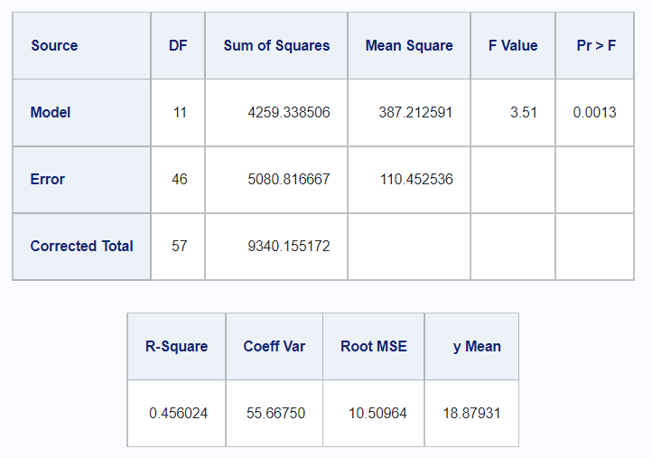
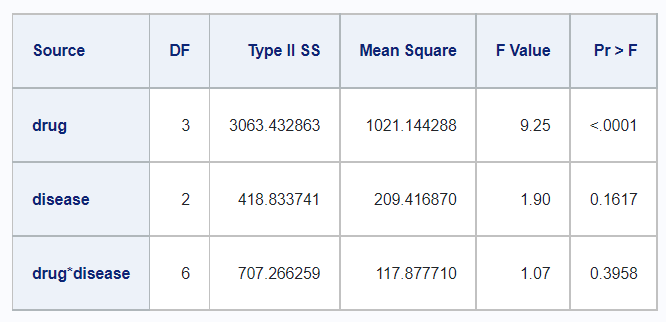
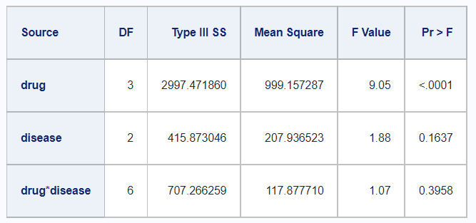

# Linear Models


## Topic 1 (BV)

### Getting Started {-}

## Sums of Squares Types

### Getting Started {-}

To demonstrate the various types of sums of squares, we'll create a data frame called `df_disease` taken from the SAS documentation (__reference__). The summary of the data is shown.


```
## # A tibble: 3 x 3
##   drug  disease     y
##   <fct> <fct>   <dbl>
## 1 1     1          42
## 2 1     1          44
## 3 1     1          36
```

```
##  drug   disease       y        
##  1:18   1:24    Min.   :-6.00  
##  2:18   2:24    1st Qu.: 9.00  
##  3:18   3:24    Median :21.00  
##  4:18           Mean   :18.88  
##                 3rd Qu.:28.00  
##                 Max.   :44.00  
##                 NA's   :14
```

### The Model {-}

For this example, we're testing for a significant difference in `stem_length` using ANOVA.  In R, we're using `lm()` to run the ANOVA, and then using `broom::glance()` and `broom::tidy()` to view the results in a table format.


```r
lm_model <- lm(y ~ drug + disease + drug*disease, df_disease)
```

The `glance` function gives us a summary of the model diagnostic values.


```r
lm_model %>% glance()
```

```
## # A tibble: 1 x 12
##   r.squared adj.r.squared sigma statistic p.value    df logLik   AIC   BIC
##       <dbl>         <dbl> <dbl>     <dbl>   <dbl> <dbl>  <dbl> <dbl> <dbl>
## 1     0.456         0.326  10.5      3.51 0.00130    11  -212.  450.  477.
## # ... with 3 more variables: deviance <dbl>, df.residual <int>, nobs <int>
```

The `tidy` function gives a summary of the model results.


```r
lm_model %>% tidy()
```

```
## # A tibble: 12 x 5
##    term           estimate std.error statistic      p.value
##    <chr>             <dbl>     <dbl>     <dbl>        <dbl>
##  1 (Intercept)      29.3        4.29    6.84   0.0000000160
##  2 drug2            -1.33       6.36   -0.210  0.835       
##  3 drug3           -13.0        7.43   -1.75   0.0869      
##  4 drug4           -15.7        6.36   -2.47   0.0172      
##  5 disease2         -1.08       6.78   -0.160  0.874       
##  6 disease3         -8.93       6.36   -1.40   0.167       
##  7 drug2:disease2    6.58       9.78    0.673  0.504       
##  8 drug3:disease2  -10.9       10.2    -1.06   0.295       
##  9 drug4:disease2    0.317      9.30    0.0340 0.973       
## 10 drug2:disease3   -0.900      9.00   -0.100  0.921       
## 11 drug3:disease3    1.10      10.2     0.107  0.915       
## 12 drug4:disease3    9.53       9.20    1.04   0.306
```


### The Results {-}

You'll see that R print the individual results for each level of the drug and disease interaction.  We can get the combined F table in R using the `anova()` function on the model object.


```r
lm_model %>% 
  anova() %>% 
  tidy() %>% 
  kable()
```


|term         | df|     sumsq|    meansq| statistic|   p.value|
|:------------|--:|---------:|---------:|---------:|---------:|
|drug         |  3| 3133.2385| 1044.4128|  9.455761| 0.0000558|
|disease      |  2|  418.8337|  209.4169|  1.895990| 0.1617201|
|drug:disease |  6|  707.2663|  117.8777|  1.067225| 0.3958458|
|Residuals    | 46| 5080.8167|  110.4525|        NA|        NA|

And with some extra work, we can get a `Total` row to match the F table output by SAS.


```r
lm_model %>%
  anova() %>%
  tidy() %>%
  add_row(term = "Total", df = sum(.$df), sumsq = sum(.$sumsq)) %>% 
  kable()
```


|term         | df|     sumsq|    meansq| statistic|   p.value|
|:------------|--:|---------:|---------:|---------:|---------:|
|drug         |  3| 3133.2385| 1044.4128|  9.455761| 0.0000558|
|disease      |  2|  418.8337|  209.4169|  1.895990| 0.1617201|
|drug:disease |  6|  707.2663|  117.8777|  1.067225| 0.3958458|
|Residuals    | 46| 5080.8167|  110.4525|        NA|        NA|
|Total        | 57| 9340.1552|        NA|        NA|        NA|

Comparing this to the output in SAS, we see the following.


```r
proc glm;
   class drug disease;
   model y=drug disease drug*disease / ss1 ss2 ss3 ss4;
run;
```



### Sums of Squares Tables  {-}

In SAS, it is easy to find the tables for the variouse types of sums of squares calculations. Unfortunately, it is not easy to match this output in using functions from base R.  However, the `rstatix` package offers a solution to produce these various sums of squares tables.  Note that there does not appear to be a `Type IV SS` equivalent in R.  

#### Type I

In R,


```r
df_disease %>% 
  rstatix::anova_test(
    y ~ drug + disease + drug*disease, 
    type = 1, 
    detailed = TRUE) %>% 
  rstatix::get_anova_table() %>% 
  kable()
```


|Effect       | DFn| DFd|      SSn|      SSd|     F|        p|p<.05 |   ges|
|:------------|---:|---:|--------:|--------:|-----:|--------:|:-----|-----:|
|drug         |   3|  46| 3133.239| 5080.817| 9.456| 5.58e-05|*     | 0.381|
|disease      |   2|  46|  418.834| 5080.817| 1.896| 1.62e-01|      | 0.076|
|drug:disease |   6|  46|  707.266| 5080.817| 1.067| 3.96e-01|      | 0.122|

And in SAS, 


#### Type II {-}

In R,


```r
df_disease %>% 
  rstatix::anova_test(
    y ~ drug + disease + drug*disease, 
    type = 2, 
    detailed = TRUE) %>% 
  rstatix::get_anova_table() %>% 
  kable()
```


|Effect       |      SSn|      SSd| DFn| DFd|     F|        p|p<.05 |   ges|
|:------------|--------:|--------:|---:|---:|-----:|--------:|:-----|-----:|
|drug         | 3063.433| 5080.817|   3|  46| 9.245| 6.75e-05|*     | 0.376|
|disease      |  418.834| 5080.817|   2|  46| 1.896| 1.62e-01|      | 0.076|
|drug:disease |  707.266| 5080.817|   6|  46| 1.067| 3.96e-01|      | 0.122|

And in SAS, 




#### Type III {-}

In R,


```r
df_disease %>% 
  rstatix::anova_test(
    y ~ drug + disease + drug*disease, 
    type = 3, 
    detailed = TRUE) %>% 
  rstatix::get_anova_table() %>% 
  kable()
```


|Effect       |       SSn|      SSd| DFn| DFd|       F|        p|p<.05 |   ges|
|:------------|---------:|--------:|---:|---:|-------:|--------:|:-----|-----:|
|(Intercept)  | 20037.613| 5080.817|   1|  46| 181.414| 0.00e+00|*     | 0.798|
|drug         |  2997.472| 5080.817|   3|  46|   9.046| 8.09e-05|*     | 0.371|
|disease      |   415.873| 5080.817|   2|  46|   1.883| 1.64e-01|      | 0.076|
|drug:disease |   707.266| 5080.817|   6|  46|   1.067| 3.96e-01|      | 0.122|

And in SAS, 



#### Type IV {-}

In SAS,


In R there is no equivalent operation to the `Type IV` sums of squares calculation in SAS.

## Contrasts

### Getting Started {-}

To demonstrate contrasts, we'll create a data frame called `df_trial`. We see that the `drug` variable has three levels, _A_, _C_ and _E_.


```
##  drug        pre             post       sex   
##  A:10   Min.   : 3.00   Min.   : 0.00   M:15  
##  C:10   1st Qu.: 7.00   1st Qu.: 2.00   F:15  
##  E:10   Median :10.50   Median : 7.00         
##         Mean   :10.73   Mean   : 7.90         
##         3rd Qu.:13.75   3rd Qu.:12.75         
##         Max.   :21.00   Max.   :23.00
```

```
## Rows: 30
## Columns: 4
## $ drug <fct> A, A, A, A, A, A, A, A, A, A, C, C, C, C, C, C, C, C, C, C, E, E,~
## $ pre  <dbl> 11, 8, 5, 14, 19, 6, 10, 6, 11, 3, 6, 6, 7, 8, 18, 8, 19, 8, 5, 1~
## $ post <dbl> 6, 0, 2, 8, 11, 4, 13, 1, 8, 0, 0, 2, 3, 1, 18, 4, 14, 9, 1, 9, 1~
## $ sex  <fct> M, F, M, F, M, F, M, F, M, F, M, F, M, F, M, F, M, F, M, F, M, F,~
```

In order to work with these levels as contrasts, we can use one of the pre-existing R functions to create the identity matrix for this factor variable. The `contr.treatment` definition is the default one that R uses, while the `contr.SAS` is the definition that SAS uses by default.


```r
contr.treatment(levels_drug)
```

```
##   C E
## A 0 0
## C 1 0
## E 0 1
```

```r
contr.SAS(levels_drug)
```

```
##   A C
## A 1 0
## C 0 1
## E 0 0
```

R also has the following definitions ready for use: `contr.sum`, `contr.poly`, and `contr.helmert`.


### Using Contrasts in R {-}

There are many ways to work with contrasts in R, but here we're only going to focus on defining contrasts in the modeling function.  In this example, we're creating a linear model to predict post values from the pre and drug values. The only difference between the two is in the contrasts argument.  In one case, we're using the R default, and in the other we're using the SAS default.


```r
model_trt <- 
  lm(post ~ pre + drug, data = df_trial,
     contrasts = list(drug = contr.treatment))

model_sas <- 
  lm(post ~ pre + drug, data = df_trial,
     contrasts = list(drug = contr.SAS))
```

Comparing the output for these two models, we see that differ in which drug level is being used as the reference baseline.


```r
tidy(model_trt)
```

```
## # A tibble: 4 x 5
##   term        estimate std.error statistic    p.value
##   <chr>          <dbl>     <dbl>     <dbl>      <dbl>
## 1 (Intercept)   -3.88      1.99    -1.95   0.0616    
## 2 pre            0.987     0.164    6.00   0.00000245
## 3 drug2          0.109     1.80     0.0607 0.952     
## 4 drug3          3.45      1.89     1.83   0.0793
```

```r
tidy(model_sas)
```

```
## # A tibble: 4 x 5
##   term        estimate std.error statistic    p.value
##   <chr>          <dbl>     <dbl>     <dbl>      <dbl>
## 1 (Intercept)   -0.435     2.47     -0.176 0.862     
## 2 pre            0.987     0.164     6.00  0.00000245
## 3 drug1         -3.45      1.89     -1.83  0.0793    
## 4 drug2         -3.34      1.85     -1.80  0.0835
```

We can define a custom contrast as well.  In this case, we are comparing _A_ to _E_, where _E_ is the baseline group. As is typical of contrasts, the values must sum to 0, where negative numbers represent the baseline groups.


```r
lm(post ~ pre + drug, data = df_trial,
   constrasts = list(drug = c("A" = 1, "C" = "0", "E" = -1)))
```

It is possible to combine contrasts using `cbind`.  Notice here that contrast definitions don't require level names to be assigned, as long as the order of the levels is maintained. 


```r
contrast_1 <- c(1,  0, -1)
contrast_2 <- c(1, -2,  1)

contrast_c <- cbind(contrast_1, contrast_2)

lm(post ~ pre + drug, data = df_trial,
   contrasts = contrast_c)
```

### Easy Contrasts in R with `emmeans` {-}

The `emmeans` package makes working with contrasts much easier.  In fact, this is the method that we recommend when trying to match contrast output between SAS and R.

We begin by defining some models.


```r
model_lm <-  lm(post ~ pre + drug + sex, data = df_trial)
model_av <- aov(post ~ pre + drug + sex, data = df_trial)
model_gm <- glm(post ~ pre + drug + sex, data = df_trial)
```

Then we convert these models to `emmeans` models.  In the `emmeans` function we can specify which variables we want to display estimated marginal means for.


```r
model_lm %>% emmeans(specs = "drug")
model_av %>% emmeans(specs = "drug", by = "sex")
model_gm %>% emmeans(specs = ~ drug | sex)
```

Or, we can define some common contrasts with the `contrast` function.


```r
# All Pairwise Comparisons
model_lm %>% 
  emmeans("drug") %>% 
  contrast(method = "pairwise")     

# Treatment v Control Comparison
model_gm %>% 
  emmeans("drug") %>% 
  contrast(method = "trt.vs.ctrl")  
```

We can also control the reference group, or reverse the contrast order using the arguments in the `contrast` function.


```r
model_lm %>% 
  emmeans("drug") %>% 
  contrast(method = "trt.vs.ctrl", ref = 2)     

model_lm %>% 
  emmeans("drug") %>% 
  contrast(method = "trt.vs.ctrl", rev = T)     
```

Custom contrasts can be defined as well.


```r
model_lm %>% 
  emmeans("drug") %>% 
  contrast(method = list(
    "A v E"  = c("A" = 1, "C" = 0, "E" = -1),
    "AE v C" = c(1, -2, 1),
    "A"      = c(1, 0, 0)
  ))
```

### Matching Contrasts: R and SAS {-}

It is recommended to use the `emmeans` package when attempting to match contrasts between R and SAS.  In SAS, all contrasts must be manually defined, whereas in R, we have many ways to use pre-existing contrast definitions.   The `emmeans` package makes simplifies this process, and provides syntax that is similar to the syntax of SAS.

This is how we would define a contrast in SAS.


```r
# In SAS
proc glm data=work.mycsv;
   class drug;
   model post = drug pre / solution;
   estimate 'C vs A'  drug -1  1 0;
   estimate 'E vs CA' drug -1 -1 2;
run;
```

And this is how we would define the same contrast in R, using the `emmeans` package.


```r
lm(formula = post ~ pre + drug, data = df_trial) %>% 
  emmeans("drug") %>% 
  contrast(method = list(
    "C vs A"  = c(-1,  1, 0),
    "E vs CA" = c(-1, -1, 2)
  ))
```

Note, however, that there are some cases where the scale of the parameter estimates between SAS and R is off, though the test statistics and p-values are identical.  In these cases, we can adjust the SAS code to include a divisor.  As far as we can tell, this difference only occurs when using the predefined Base R contrast methods like `contr.helmert`.


```r
proc glm data=work.mycsv;
   class drug;
   model post = drug pre / solution;
   estimate 'C vs A'  drug -1  1 0 / divisor = 2;
   estimate 'E vs CA' drug -1 -1 2 / divisor = 6;
run;
```
